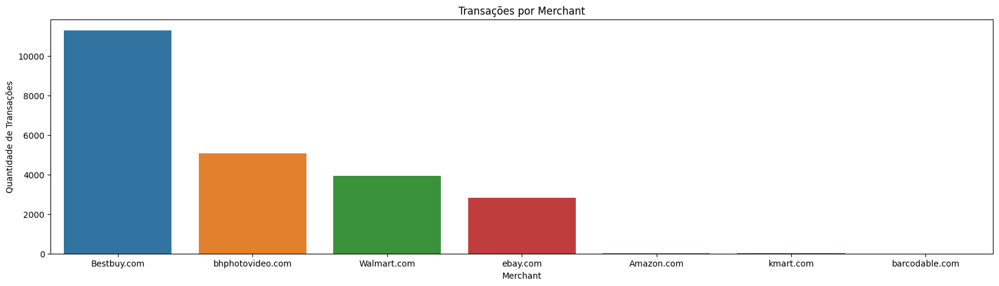
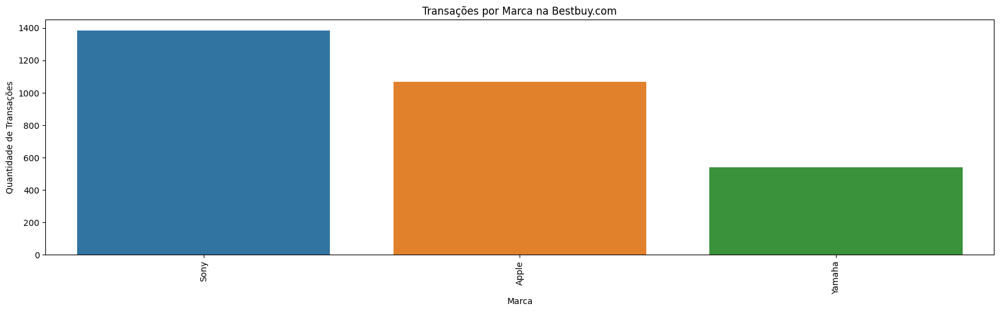
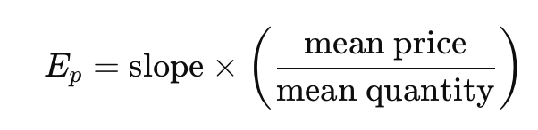
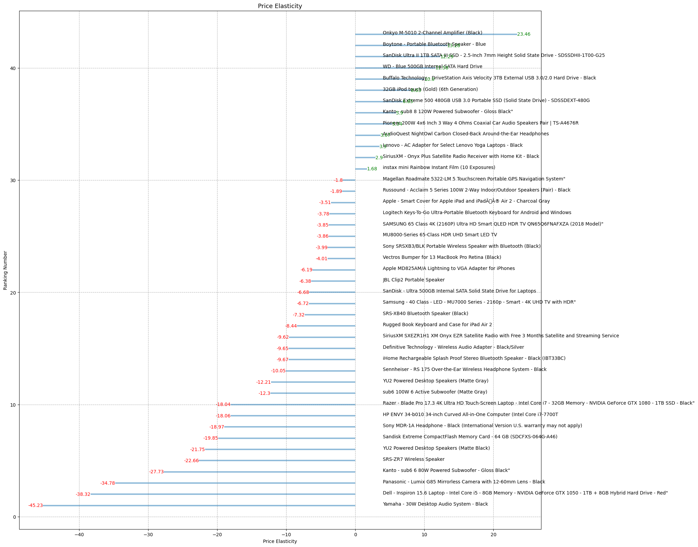
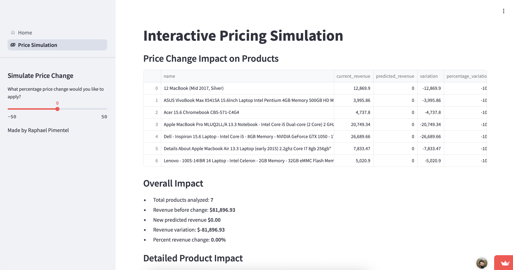

# Análise de Elasticidade de Preço - BestBuy.com

## Visão Geral do Projeto

Em um ambiente altamente competitivo e sensível a preços como o de eletrônicos, a BestBuy.com buscava otimizar sua estratégia de precificação para maximizar receita e margem de lucro. Este projeto teve como foco o **cálculo da elasticidade-preço da demanda** com base em dados históricos de vendas, resultando em insights estratégicos para pricing e campanhas promocionais.

**Objetivo**: Prever como alterações nos preços impactam a demanda por produto, otimizando a definição de preços com base em dados.

**Resultado-chave**: 
> Simulação mostrou um aumento potencial de **+209.79% no faturamento** com base em recomendações baseadas na elasticidade.

## Ferramentas e Tecnologias

- **Python 3.11.4**: Análise e modelagem estatística
- **Statsmodels (OLS)**: Cálculo de elasticidade com significância estatística
- **Streamlit**: Criação de WebApp para democratizar acesso aos resultados
- **Git + Pyenv**: Versionamento e controle de ambiente
- **Análise Estatística**: Premissas, filtragens e tratamento de outliers

## Dataset

**Fonte**: Dados transacionais de vendas de eletrônicos em 2017 na BestBuy.com  
**Principais colunas**:
- `Date_imp`: Data da transação
- `Category_name`, `name`, `brand`: Informações do produto
- `price`, `currency`: Dados financeiros
- `merchant`: Loja responsável pela venda
- `weight`: Características adicionais do produto

## Exploração e Pré-processamento

- Foco em transações entre **maio e dezembro de 2017**
- Seleção do **merchant BestBuy.com** por volume
- Filtragem de preços abaixo de $5 para remover outliers
- Exclusão de produtos com >2 meses sem vendas

Análises revelaram:
- BestBuy.com como principal merchant
  
- Apple e Sony com maior volume de vendas
  
- Casos de preços anômalos para produtos populares foram tratados

## Elasticidade-Preço da Demanda

Elasticidade mede a sensibilidade da demanda à variação de preço:

- **Elasticidade negativa** (mais comum): aumento no preço reduz demanda
- **Tipos**:
  - Elástica (|e| > 1): muito sensível
  - Inelástica (|e| < 1): pouco sensível
  - Unitária (|e| = 1): proporcional

Foram analisados 485 produtos, mas apenas 43 apresentaram relação estatisticamente significativa entre preço e demanda (95% de confiança).

## Modelagem Estatística

Utilizei regressão linear (OLS) por produto para estimar elasticidade.  
Critérios para validade:
- p-valor < 0.05
- Interpretação dos coeficientes para definir a sensibilidade

## Simulação de Performance Comercial

A partir dos 43 produtos com elasticidade significativa, simulei cenários de otimização:

- **Desconto de 25%** para produtos com elasticidade negativa
- **Aumento de 10%** para produtos com elasticidade positiva
- Filtragem por crescimento real no faturamento

### Resultado:

| Métrica | Valor |
|--------|-------|
| Faturamento Dez/17 | $56.437,73 |
| Projeção Jan/18 | $174.840,04 |
| **Crescimento estimado** | **+209.79%** |

## Elasticidade Cruzada

Além da elasticidade própria, também calculei **elasticidade cruzada** para identificar produtos:

- **Complementares**: aumento da demanda de B quando o preço de A cai
- **Substitutos**: aumento da demanda de B quando o preço de A sobe

### Exemplos:
- Complementares: Subwoofer e caixas de som
- Substitutos: SSDs e HDs

Utilizado para sugerir **estratégias de cross-sell e gestão de estoque**.

## WebApp Interativo (Streamlit)

Plataforma interativa desenvolvida para facilitar o acesso e análise dos dados:

🔗 [Acesse aqui o WebApp](https://price-app.streamlit.app)

### Funcionalidades:
- **Visualização de elasticidades e gráficos**
- **Download de dados com métricas estatísticas**
- **Simulação de receita com base em ajustes de preço**
- **Recomendações de produtos complementares/substitutos**
  

## Competências Demonstradas

- **Business Analytics**: Transformação de dados em insights acionáveis
- **Estatística Aplicada**: Regressão linear, significância estatística
- **Storytelling com Dados**: Apresentação clara para tomada de decisão
- **Desenvolvimento Web com Python**: Deploy em ambiente interativo
- **Pensamento Crítico e Resolução de Problemas**
