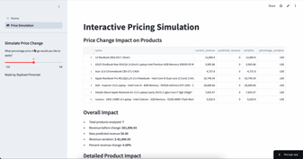

### **Price Elasticity and Sales Insights**

---

#### **Overview**

This project involves analyzing sales data from multiple merchants to identify trends, insights, and price elasticity of specific products. The analysis spans data exploration, feature engineering, and machine learning modeling to calculate and visualize the price elasticity of demand for laptops and computers sold by BestBuy.

---

#### **Interactive Dashboard**

You can access the interactive dashboard to explore insights dynamically from here: https://price-app.streamlit.app

#### **Project Structure**

1. **Data Preparation**
   - Loading and cleaning the dataset.
   - Renaming columns to snake_case for consistency.
   - Handling missing values and adjusting data types.

2. **Exploratory Data Analysis (EDA)**
   - Descriptive statistics for numerical and categorical attributes.
   - Visualization of sales trends:
     - Top merchants.
     - Best-selling categories, brands, and time periods (days, months, weeks).
   - Comparative analysis of sales trends across merchants.

3. **Feature Engineering**
   - Filtering data for laptops and computers sold on BestBuy.
   - Aggregating weekly sales data for demand and price by product.
   - Creating datasets for independent variables (`X`) and dependent variables (`Y`).

4. **Descriptive Statistics**
   - Calculating central tendency and dispersion metrics for:
     - `X` (price data).
     - `Y` (demand data).

5. **Machine Learning Modeling**
   - Fitting linear regression models for each product to determine the relationship between price and demand.
   - Key outputs:
     - Price elasticity of demand.
     - Regression statistics (intercept, slope, R-squared, p-values).

6. **Price Elasticity Analysis**
   - Ranking products by price elasticity.
   - Visualizing elasticity values and product rankings.

---

#### **Key Features**

1. **Data Cleaning & Organization**
   - Removal of unnecessary columns.
   - Handling NA values with statistical replacements.

2. **Visualization**
   - Bar plots to identify trends for:
     - Merchants with the most sales.
     - Best-selling categories, brands, and timeframes.
   - Subplots for comparing trends across merchants.

3. **Price Elasticity Calculation**
   - Elasticity formula: 
   - Identification of inelastic and elastic products.
   - Product ranking by elasticity.

---

#### **Tools & Libraries**

- **Data Manipulation:** `pandas`, `numpy`
- **Visualization:** `seaborn`, `matplotlib`
- **Modeling:** `statsmodels`

---

#### **Insights**

- **Merchants and Categories:** Identified top merchants and product categories driving sales.
- **Temporal Trends:** Uncovered key days, months, and weeks contributing to higher sales.
- **Elasticity Insights:** Products with high elasticity indicate strong price sensitivity, offering actionable insights for pricing strategies.

---

#### **Next Steps**

- Automate the pipeline for updating datasets and recalculating elasticity.
- Incorporate additional features such as marketing campaigns or competitor pricing. 

---

#### **Acknowledgments**

This analysis was conducted using open-source libraries and publicly available sales data. Special thanks to contributors for their efforts in data processing and visualization.
